# NXP Application Code Hub

## How to enable low power in your application on MIMXRT700-EVK

This demo is an example of low power thermometer and clock which is based on LVGL 9.3.0 and GUI Guider 1.9.1-GA. It can be used to evaluate low power performances on MIMXRT700 cores with a 1FPS display and to discover how to use power manager on this chip. 
Here, this demo uses on-board I3C temperature sensor and RTC to gather temperature and current time. User can connect current probes directly on cores power lines to evaluate power consumption. User can also use buttons SW5 and SW7 to set current time.

#### Boards: MIMXRT700-EVK
#### Categories: Graphics, Real Time Clock, Low Power
#### Peripherals: I3C, DISPLAY
#### Toolchains: VS Code

## Table of Contents

1. [Software](#step1)
2. [Hardware](#step2)
3. [Setup](#step3)
4. [Results](#step4)
5. [Application workflow](#step5)
6. [Power Consumption](#step6)
7. [Low Power Tips](#step7)
8. [Glossary](#step8)
9. [FAQs](#step9)
10. [Support](#step10)
11. [Release Notes](#step11)

## 1. Software

The software for this demo is delivered in raw source files and MCUXpresso IDE for Visual Studio Code projects. Software version:

1. **[MCUXpresso IDE V25.8.53 for Visual Studio Code](https://www.nxp.com/design/design-center/software/development-software/mcuxpresso-software-and-tools-/mcuxpresso-for-visual-studio-code:MCUXPRESSO-VSC)**: This example supports MCUXpresso IDE V25.8.53 for Visual Studio Code, for more information about how to use Visual Studio Code please refer [here](https://www.nxp.com/design/training/getting-started-with-mcuxpresso-for-visual-studio-code:TIP-GETTING-STARTED-WITH-MCUXPRESSO-FOR-VS-CODE).

2. **[GUI Guider V1.9.1](https://www.nxp.com/design/design-center/software/development-software/gui-guider:GUI-GUIDER)**: You can modify the graphical elements of this demo by opening project *RT700_GUI_ThermometerClock* with GUI Guider V1.9.1. This is optional though, and graphics related files are already generated.

## 2. Hardware

The hardware environment for this demo is listed here:

1. **[MIMXRT700-EVK](https://mcuxpresso.nxp.com/mcuxsdk/latest/html/boards/RT/mimxrt700evk/index.html)** board

2. **[G1120B0MIPI](https://www.nxp.com/design/development-boards/i-mx-evaluation-and-development-boards/1-2-wearable-display-g1120b0mipi:G1120B0MIPI)** 1.2in 390x390 MIPI display module

3. **Micro USB** cable

4. **Personal Computer**

## 3. Setup

### 3.1 Step 1: Hardware configuration

#### 3.1.1 Prepare MIMXRT700-EVK, Micro USB cable and G1120B0MIPI.  
   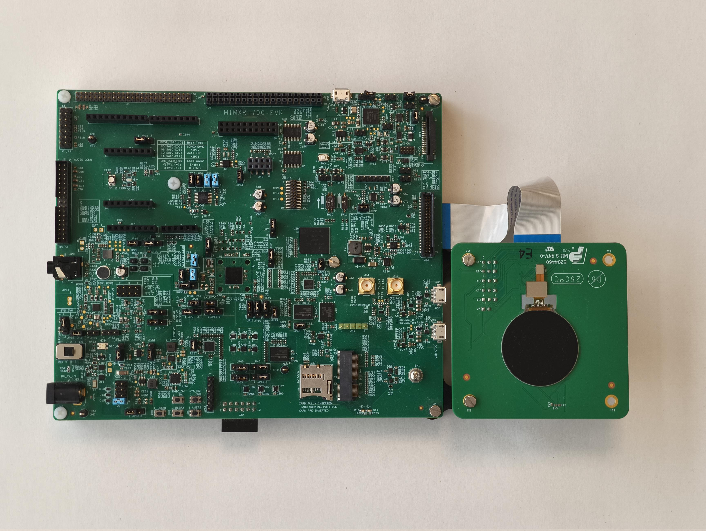</img>

#### 3.1.2 Plug FPC/FFC flat ribbon into G1120B0MIPI (J1).  
   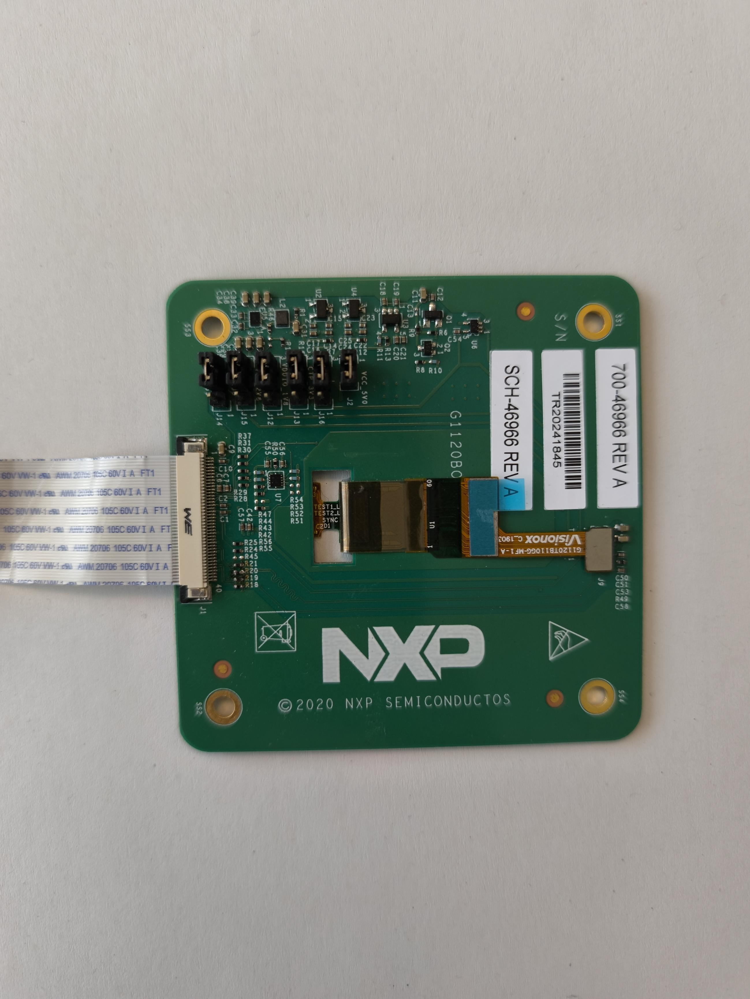</img>

#### 3.1.3 Plug FPC/FFC flat ribbon into MIMXRT700-EVK (J52).    
   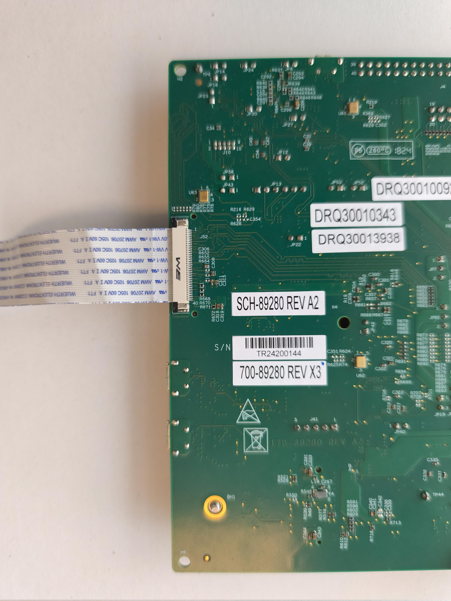</img>

#### 3.1.4 Place Jumpers JP1 and JP3.  
   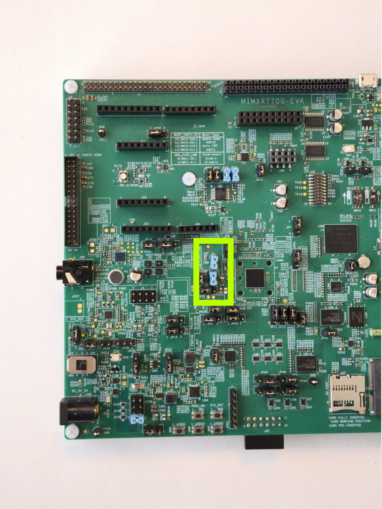</img>

#### 3.1.5 Connect Micro USB cable to USB port J54.
   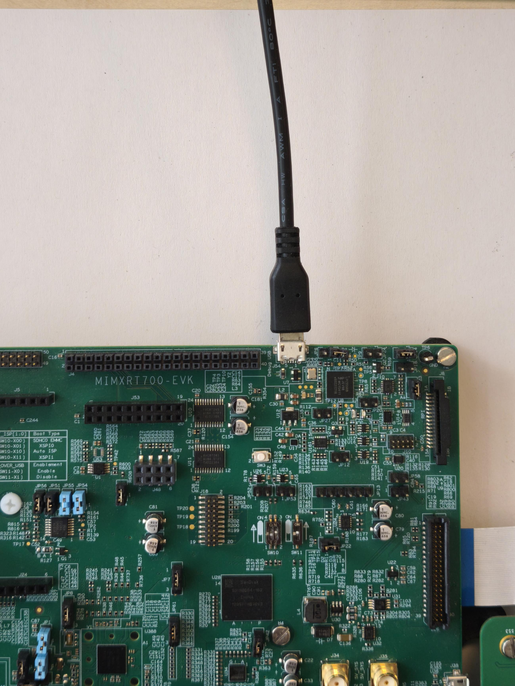</img>

### 3.2 Step 2: Software configuration

#### 3.2.1 Download and Install required Software(s)
- Download and Install [VS Code IDE](https://code.visualstudio.com/download)
- Install MCUXpresso for VS Code Extension
  - Open VS Code.
  - Open the Extensions Marketplace (press Ctrl+Shift+X).
  - Search "MCUXpresso" in the extension search window at the top left.
  
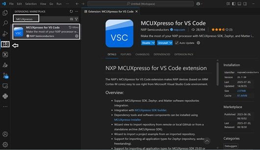 
  - Click on Install button in the extension overview.
  - This will install the MCUXpresso extension for VS Code.
- Download and Install [MCUXpresso Installer](https://www.nxp.com/lgfiles/updates/mcuxpresso/MCUXpressoInstaller.exe)
  - You can select one or multiple items from the available list. Once at least one package is selected, the two top-right buttons "Install" and "Show details" become enabled.
  - Select “Software kits” items (MCUXpresso SDK Developer, Zephyr Developer), select Arm components items (all), select Debug Probes Software item (all) and rest of the items can be selected as required.
    
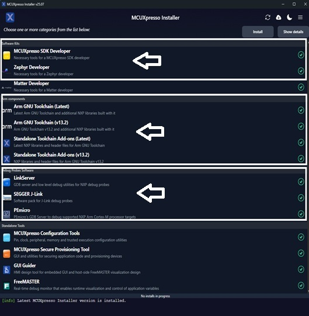 
  - Click on “Install” button to start installing selected items.

#### 3.2.2 Get example projects from Application Code Hub (ACH) GitHub
- Open VS Code and select "Clone Git Repository" option.  
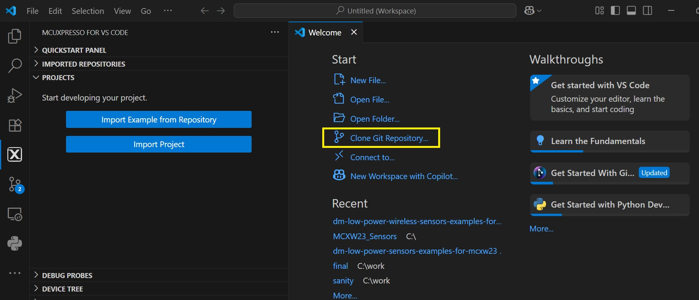 
- VS Code will open a pop-up to allow you to enter the Git repository URL.  
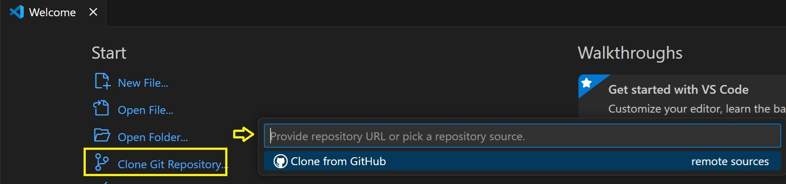 
- Copy the ACH GitHub URL:"https://github.com/nxp-appcodehub/dm-mimxrt700-evk-dual-core-low-power-thermometer-clock.git" and select the "Clone from URL" option.  
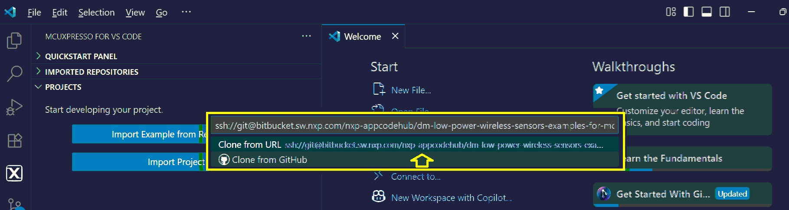 
- It will ask for local destination directory where you would like to save the cloned repository, create a "git" folder under C:/ drive and select that folder.  
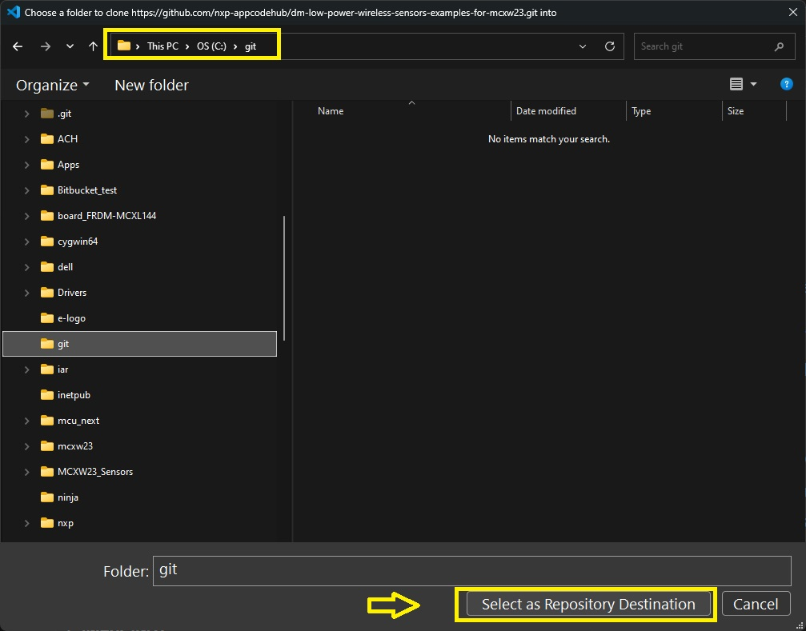 
- VS Code will start cloning the repository into the destination folder.
- Click on "Import Project(s)" to start importing the chosen ACH project(s).  
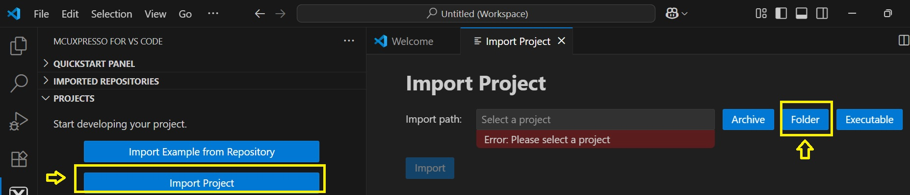 
- Select the cloned repository destination folder i.e. "C:/git/dm-mimxrt700-evk-dual-core-low-power-thermometer-clock".  
- Import Sense Core project "rt700_i3c_temp_sensor_core1" into VS code workspace:  
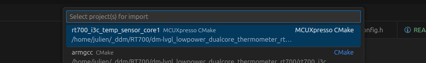 
- Select the toolchain version: ARM GNU Toolchain.
- The selected "rt700_i3c_temp_sensor_core1" project is now imported on the VS Code workspace.
- Import Compute Core project "rt700_dual_core_low_power_thermometer" into VS code workspace:  
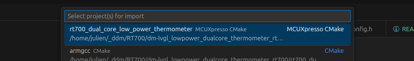 
- Select the toolchain version: ARM GNU Toolchain.
- The selected "rt700_dual_core_low_power_thermometer" project is now imported on the VS Code workspace.

#### 3.2.3 Build projects
- For better power consumption results, you can build project in release mode by selecting "release" in the "Build Configuration" section of the project.  
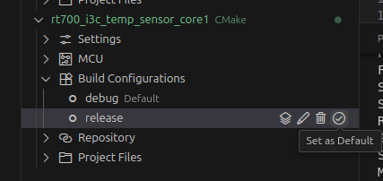 
- Right click on Sense Core project "rt700_i3c_temp_sensor_core1" and select "Pristine Build/Rebuild Project" to start clean build the project.  
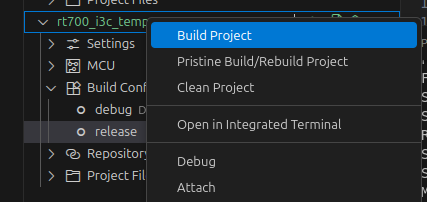 
- Do the same steps for Compute Core project "rt700_dual_core_low_power_thermometer".

### 3.3 Step 3: Flash application

- Make sure board is connected to your computer via USB.
- In the MCUXpresso for VS Code tab, click on "Refresh Debug Probes".  
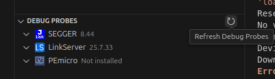 
- Click on "Open Flash Programmer" on the right side of your now displayed board.   
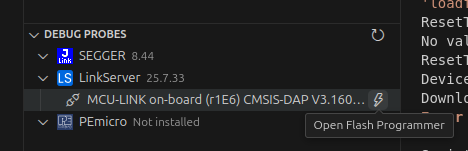 
- Select Project "rt700_dual_core_low_power_thermometer". Debug configuration can be Debug, it does not matter for flashing.  
- Select built file from your project folder's armgcc/release subfolder (or armgcc/debug if building in debug mode). It should be *lvgl_guider_cm33_core0.elf*.   
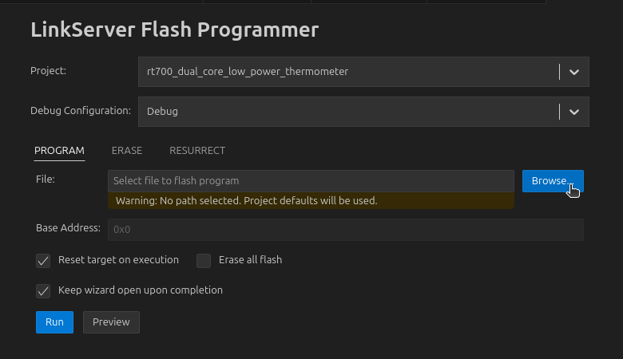 
- Check "Reset target on execution" box. Then click on "Run" Button.
- In case flashing is not successful, unplug JP1, flash again, then plug JP1 again. 

## 4. Results

When this demo board is powered up, the demo will show the home screen: 
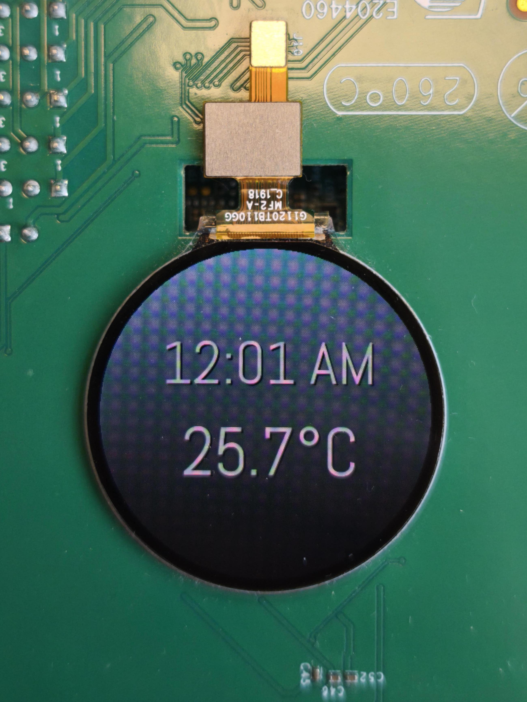 
The degree symbol should be blinking each second, while temperature is updated whenever it has changed. Time is updated every minute.
User can monitor power consumption of cores via JP1 (Compute Core VDD2), JP3 (Sense Core VDD1) and JP2 (Shared peripherals VDDN) between pins 2 and 3.

## 5. Application workflow

Application workflow is like this :  
</img>

After both cores are initialized and put in Deep Sleep mode, the main loop is occurring as following:
    
1. The Compute core is woken up by an RTC interrupt.
2. LVGL clock label is updated with current RTC value when minutes value has changed (this does not update the frame buffer itself).
3. A word is written by Compute core in the message unit (MU) shared with Sense core. The word itself is not important, it is just used to wake the Sense core:  
   1. When out of Deep Sleep mode, Sense core communicates with on-board I3C temperature sensor.
   2. Sense core writes this temperature value inside message unit (MU).
   3. Sense core goes back in Deep Sleep mode.
4. In the meantime, LVGL looks for all invalid areas (possibly clock, temperature and degree labels) and do the follow for each:
   1. Use GPU to redraw the area in the frame buffer.
   2. Use LCD Interface (LCDIF) to send that area to the MIPI display.
   3. During those parts, Compute core itself is idling. It can go into Sleep mode.
5. After screen is updated, Compute core waits for temperature value sent by Sense core. Sense core is too fast to allow Compute core to go in any sleep mode at this moment.
6. LVGL Temperature label is updated with temperature value. This temperature will be displayed at the next occurrence of screen update.
7. RTC Alarm is set to trigger an interrupt at t + 1s.
8. Compute core goes in Deep Sleep while waiting for RTC Alarm interrupt.

The cycle continues forever. Pressing SW5 or SW7 simply wakes the Compute core earlier to update RTC value then update displayed time.

## 6. Power Consumption

Below table represents power consumption for each core power rail (VDDN/VDD1/VDD2):

| Power Rail | Voltage   (Active and Sleep Mode) | Voltage   (Deep Sleep Mode) | Average Power Consumption   (over 1 minute) |
| ---------- | :----------------------------------: | :----------------------------: | --------------------------------------------: |
| VDDN       |  1.0 V                               | 0.5 V                          |  39 µW                                        |
| VDD1       |  0.7 V                               | 0.5 V                          |  26 µW                                        |
| VDD2       |  0.8 V                               | 0.5 V                          | 145 µW                                        |

 VDD2 power profile looks like this: 
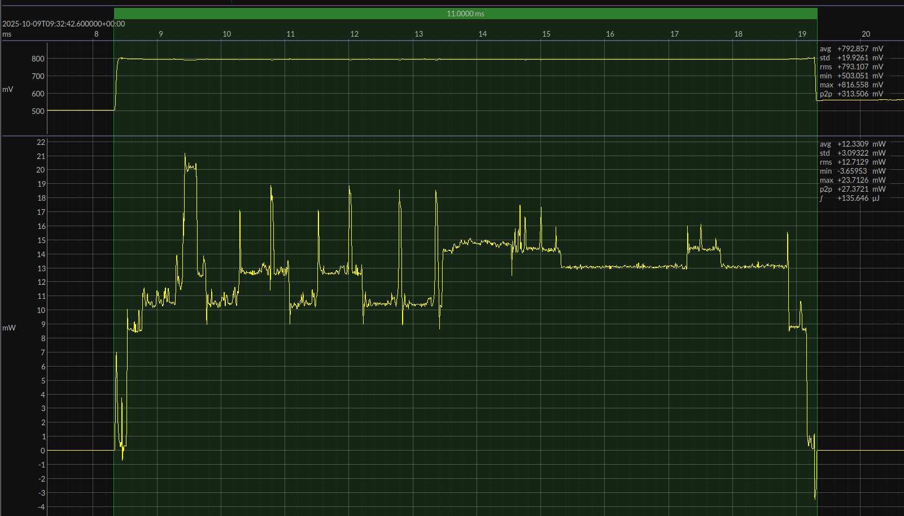

## 7. Low Power Tips

You can find below some advice on how to reduce your power consumption on your RT700 cores. You can of course help yourself with the low power examples from the SDK.

### 1. Stop Unused Clocks and Peripherals

   One of the first source of useless power consumption is the unused block and clocks. First tip is to cut all of them through functions like `POWER_EnablePD` or `CLOCK_DisableClock`.
   
      /* Enable Power Down for NPU RAMs periphery */
      POWER_EnablePD(kPDRUNCFG_PPD_NPU);
      /* Gate NPU clock */
      CLOCK_DisableClock(kCLOCK_Npu0);

   In this example code, you can find all the powered down modules and clocks in `power_management.c` functions `BOARD_DisableUnusedClocks` and `BOARD_DisableUnusedModules`.

### 2. Reduce Running Clocks

   Another way to reduce cores power consumption is to reduce the power drawn by clock usage.  
   For example you can start by using less consuming clocks (such as FRO instead of PLLs when possible). When less consuming clock source is selected, you can now reduce the frequency of some clocks applied to your IPs. 

   In this example code, to reduce overall power consumption, we used an FRO to clock the MIPI and LCDIF IPs, instead of a PLL. Clock applied is lower than the PLL, but it allows to reduce power significantly (additionally, PLL requires activating/deactivating when going in Deep Sleep mode as explained later).

   Don't hesitate to use functions such as `CLOCK_AttachClk` and `CLOCK_SetClkDiv` to respectively set source and divider or IPs clocks

      /* Attach FRO0_DIV1 clock to GPU */
      CLOCK_AttachClk(kFRO0_DIV1_to_VGPU);
      /* Set GPU clock divider to clock with FRO0_DIV1 / 2 */
      CLOCK_SetClkDiv(kCLOCK_DivVgpuClk, 2);

### 3. Use PMIC to power cores

   Power is the result of multiplication of voltage and current. So of course, reducing cores voltage will reduce power consumption (even a bit more than expected cause current will also drop a bit).  
   It is possible to change those voltages by setting the LDOs of the chip, but it is highly recommended to use on-board PMIC (Power Management Integrated Circuit) in order to reduce power loss of chip LDOs. 
   Of course, NXP cannot guarantee that MIMXRT700 would be working for all frequency/voltage associations. Please refer to MIMXRT700 Datasheet to see guaranteed conditions.  
   In our example, reducing Compute core to 92MHz allows to reduce VDD2 voltage.
   Please refer to MIMXRT700 SDK for more low power examples on how to reduce cores voltages.

### 4. Use Deep Sleep Mode

   Generally, in a context such as the one of this demo, the cores are powerful and handling graphical components, but they are not running all the time. In this example, the cores run for an average of about 10 ms every second, so approximately 1 percent of the time.  
   It is not even considerable to have a while loop waiting for the next RTC interrupt. That would be a great way to drain a battery life.  
   To solve this, we use MIMXRT700's several IPs to manage power consumption of the chip. The goal here is to stop everything possible during the time the cores do nothing: Deep Sleep ! Another mode (Sleep) can be used when core is waiting for a oncoming interrupt of a running IP (LCDIF or GPU for example).  
   On MIMXRT700, software drivers are available to simplify this. The following steps will explain how to use it:

   1. Initialize Power Manager 
      First step is to declare a power manager handler in your code:

            AT_ALWAYS_ON_DATA(pm_handle_t g_pmHandle);
   
      Then you have to call the function `PM_CreateHandle`:

            PM_CreateHandle(&g_pmHandle);  
   
   2. Enable Wake Up Sources for Power Manager 
      By using function `PM_InitWakeupSource`, you can select which interrupts will be able to get the chip out of its low power state:

            /* Declare wakeup source variable */
            AT_ALWAYS_ON_DATA(pm_wakeup_source_t g_OstimerWakeupSource);
            /* Init wakeup source variable with corresponding IRQn */
            PM_InitWakeupSource(&g_OstimerWakeupSource, (uint32_t)OS_EVENT_IRQn, NULL, true);

   3. Select Power Constraint 
      When calling function to enter low power (see later), chip will enter lowest power mode available (Full Deep Power Down by default).  

      To use a higher power mode, you can use function `PM_SetConstraints`.   
      This function has a first parameter that puts a constraint on the power mode.   
      To release that constraint, call the function `PM_ReleaseConstraints`, with the same first parameter.   

      User can also set constraints on the resources that will be kept on during lower power mode.   
      To do so, it needs to use the other parameters of this function like so: `N, PM_RESC_X, PM_RESC_Y...`, with `N` as the number of constraints following, and `PM_RESC_X/Y` the resource to keep on.   
      Constraint can be release on that resource, the same way it released the power mode. It is important to make sure that every set resource constraint should be released before setting it again.  

      Best way to handle all this is to set resource and power constraints separately:

            /* Apply a constraint on low power mode */
            PM_SetConstraints(PM_LP_STATE_DEEP_SLEEP, 0)
            /* Apply a constraint on resources (keeping VNCOM and V2MIPI domains enabled) */
            PM_SetConstraints(PM_LP_STATE_NO_CONSTRAINT, 2, PM_RESC_VNCOM_ON, PM_RESC_V2MIPI_ON)

   4. Enable Power Manager 
      You can enable/disable the power manager to prevent core from entering low power mode when it is handled by another task.   
      Use functions `PM_EnablePowerManager` and `PM_DisablePowerManager`. Those work as a counter.   
      Disable increases the counter, while Enable decreases it.   
      When trying to enter low power, it will only be allowed to do so if this counter is 0.   
      Counter is initialized at value 1, so a first call to `PM_EnablePowerManager` is required.

   5. Enter Low Power 
      When ready to enter low power modes (e.g. when waiting for an RTC interrupt), just call function `PM_EnterLowPower`.   
      The power management driver will automatically select the lowest power mode available and stop all resources except for the ones you explicitely mentioned as explained earlier.  

      Before and after this function, you should call `POWER_ModuleEnterLPRequest` and `POWER_ModuleExitLPRequest` for all your wake-up interrupt source IPs.  
      Please see the following example with RTC:

            POWER_ModuleEnterLPRequest(kPower_RTC_STOP);
            PM_EnterLowPower(0);
            POWER_ModuleExitLPRequest(kPower_RTC_STOP);
      
   After these steps, overall power consumption should be decreased.  
   Please note that voltages provided by PMIC can be lowered during low power (e.g. deep sleep), to reduce even further more to power consumption during low power. 

### 5. Stop High Power Consuming IPs Clock As Often As possible

   Finally, when the application cannot find time to enter low power modes, one final step can be used: stop IPs when not in use. In our example, we gate the GPU clock when not in use, using `vg_lite_set_gpu_execute_state`, to notify state of the GPU. It allows to save several milliamps of currents when GPU is not used. 
   The same strategy is applied with MIPI and LCDIF clocks when not transferring buffer to the display.

## 8. Glossary

| Term   | Definition                           |
| ------ | ------------------------------------ |
| ACH    | Application Code Hub                 |
| FPS    | Frames Per Second                    |
| GPU    | Graphics Processing Unit             |
| I3C    | Improved Inter-Integrated Circuit    |
| LCDIF  | Liquid Crystal Display Interface     |
| LVGL   | Light and Versatile Graphics Library |
| MIPI   | Mobile Industry Processor Interface  |
| MU     | Messaging Unit                       |
| RTC    | Real-Time Clock                      |

## 9. FAQs

No FAQs have been identified for this project.

## 10. Support

#### Project Metadata

<!----- Boards ----->

<!----- Categories ----->

<!----- Peripherals ----->

<!----- Toolchains ----->

Questions regarding the content/correctness of this example can be entered as Issues within this GitHub repository.

> **Warning**: For more general technical questions regarding NXP Microcontrollers and the difference in expected funcionality, enter your questions on the [NXP Community Forum](https://community.nxp.com/)

## 11. Release Notes

| Version | Description / Update                    | Date                           |
|:-------:| --------------------------------------- | ------------------------------:|
| 1.0     | Initial release on Application Code Hub | November 1st 2025 |
